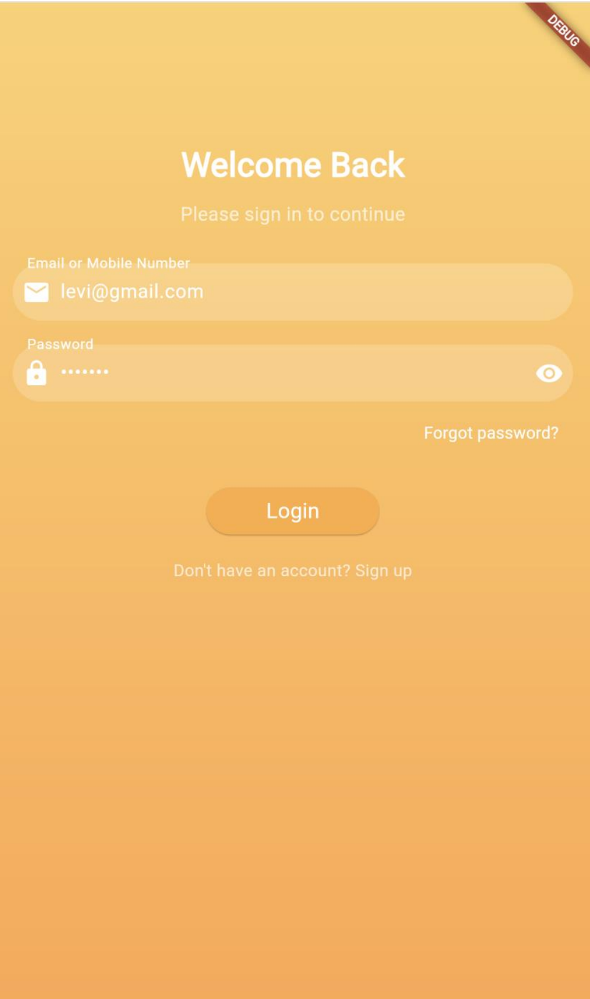
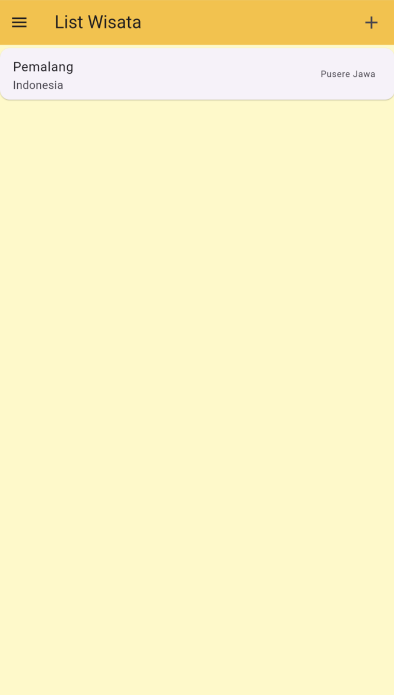
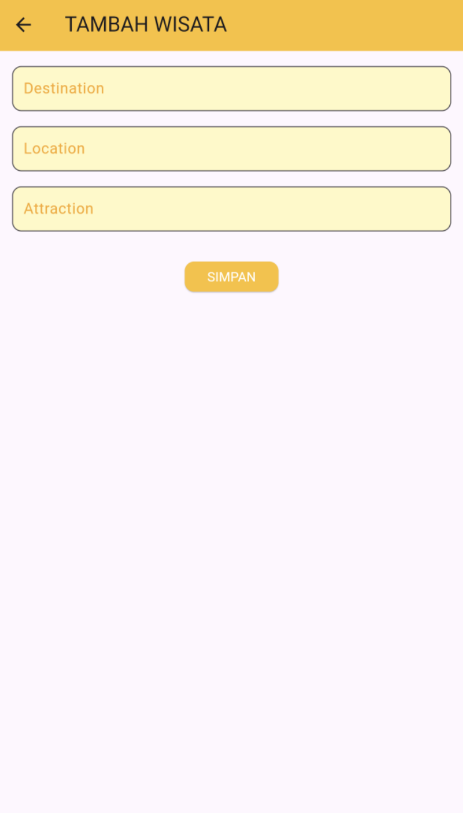
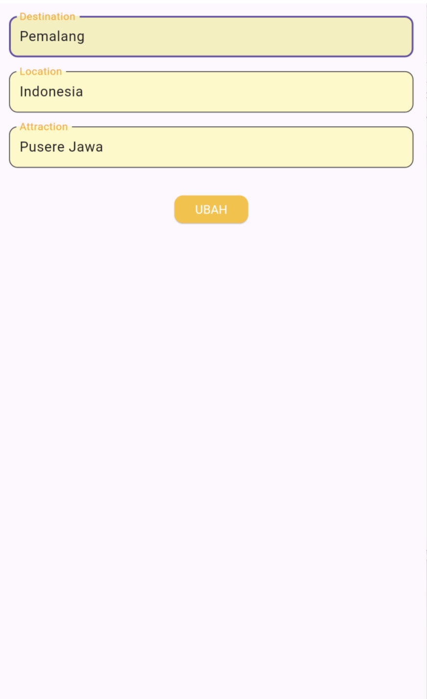
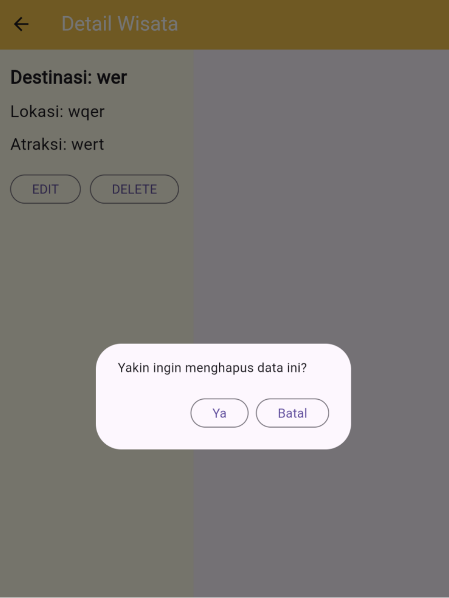

# Responsi I

Nama : Muhammad Levi Asshidiqi

NIM : H1D022103

Shift Baru: A

# Proses Register

1. Pengguna mengisi formulir registrasi dengan tiga input: nama, email, dan password.
   - Masing-masing dikelola oleh `TextEditingController`:
     - `TextEditingController _namaTextboxController` untuk nama.
     - `TextEditingController _emailTextboxController` untuk email.
     - `TextEditingController _passwordTextboxController` untuk password.

2. Validator untuk setiap input:
   - Nama: maksimal 3 karakter.
   - Email: Wajib diisi dan valid.
   - Konfirmasi Password: Harus sama dengan password yang diinput.

3. Ketika tombol "Registrasi" ditekan:
   - Fungsi `_submit()` dipanggil setelah validasi berhasil.
   - Jika validasi sukses dan tombol tidak dalam status loading, proses registrasi dimulai dengan memanggil `RegistrasiBloc.registrasi` untuk mengirim data ke backend.

4. Setelah registrasi:
   - Jika berhasil: Menampilkan dialog sukses dengan `SuccessDialog`.
   - Jika gagal: Menampilkan dialog peringatan dengan `WarningDialog`.

# Proses Login

1. Pengguna memasukkan email dan password di form yang disediakan.
   - Input ini dikelola oleh `TextEditingController`:
     - `TextEditingController _emailTextboxController` untuk email.
     - `TextEditingController _passwordTextboxController` untuk password.

2. Setelah mengisi email dan password, pengguna menekan tombol "Login" (`_buttonLogin`).
   - Tombol ini memanggil metode `_submit()` saat ditekan.
   - Dalam `_submit()`, form divalidasi dengan:
     - Mengecek apakah form valid menggunakan `_formKey.currentState!.validate()`.
     - Memastikan proses loading (`_isLoading`) tidak sedang berlangsung.

3. Setelah validasi berhasil:
   - Fungsi `LoginBloc.login()` dipanggil dengan parameter email dan password yang diinput oleh pengguna.
   - Fungsi ini mengembalikan `Future`, dan menggunakan `.then()` untuk menangani respons.

4. Jika login berhasil:
   - Jika `value.code` sama dengan 200:
     - Token dan ID pengguna disimpan menggunakan kelas `UserInfo`.
     - Dialog sukses ditampilkan menggunakan `SuccessDialog` untuk memberi tahu bahwa login berhasil.
     - Setelah pengguna menekan tombol "OK" di dialog sukses, mereka akan diarahkan ke halaman wisata (`wisataPage`).

5. Jika respons dari server tidak berhasil (misalnya, jika kode yang diterima bukan 200), atau jika terjadi kesalahan selama proses login yang ditangani oleh `.catchError()`, maka dialog peringatan akan ditampilkan menggunakan `_showWarningDialog()`. Dialog ini akan memberi tahu pengguna bahwa proses login telah gagal, sehingga pengguna dapat mengambil tindakan lebih lanjut atau mencoba kembali.

# Proses Ubah Data

1. Di halaman `wisataPage`, pengguna dapat melihat daftar wisata yang tersedia.
   - Saat pengguna mengklik salah satu wisata, mereka akan diarahkan ke halaman detail wisata.

2. Ketika pengguna menekan tombol "EDIT", aplikasi akan mengarahkan mereka ke halaman `wisataForm` dengan mengirimkan objek wisata yang dipilih.
   - Di halaman `wisataForm`, pengguna dapat mengedit data wisata, seperti nama, harga, dan informasi lainnya.

3. Setelah pengguna menyelesaikan pengeditan dan menekan tombol simpan, wisata akan diperbarui di database melalui `wisataBloc`.
   - Proses penyimpanan ini memastikan bahwa data yang dimasukkan valid, dan juga memperbarui status aplikasi jika diperlukan.

4. Sebagai contoh, jika harga monitor berhasil diubah, data yang ditampilkan di `wisataPage` akan ter-update secara otomatis.

# Proses Hapus Data

1. Ketika pengguna mengklik tombol "DELETE", fungsi `confirmHapus()` akan dipanggil.
   - Fungsi ini menampilkan dialog konfirmasi yang menanyakan kepada pengguna apakah mereka yakin ingin menghapus data.

2. Jika pengguna mengonfirmasi dengan menekan tombol "Ya", sistem akan memanggil metode `deletewisata` pada `wisataBloc`, menggunakan ID wisata yang ingin dihapus.

3. Jika proses penghapusan berhasil:
   - Aplikasi akan kembali ke halaman `wisataPage` untuk memperbarui daftar wisata.
   - Jika penghapusan gagal, dialog peringatan akan muncul, memberi tahu pengguna bahwa penghapusan telah gagal.

4. Setelah proses penghapusan, di halaman `wisataPage` akan terlihat bahwa data wisata tidak ada atau berhasil dihapus.

# Proses Tambah Data

1. Di halaman `wisataPage`, ketika pengguna menekan simbol "+" yang berada di kanan atas, aplikasi akan mengarahkan pengguna ke halaman `wisataForm`.
   - Halaman ini menyediakan beberapa kolom input untuk mengumpulkan informasi mengenai wisata baru, seperti nama wisata, harga, dan kode wisata.

2. Pengguna kemudian mengisi formulir di `wisataForm` dan menekan tombol "SIMPAN".
   - Ketika tombol tersebut ditekan, fungsi `_tambahwisata()` akan dipanggil untuk memproses penambahan wisata baru.

3. Jika validasi berhasil:
   - Objek wisata baru akan dibuat, dan metode dari `wisataBloc` akan dipanggil untuk menyimpan wisata tersebut ke dalam database.

4. Setelah proses penyimpanan berhasil, pengguna akan kembali ke `wisataPage`.
   - Saat halaman `wisataPage` dimuat kembali, aplikasi akan mengambil data wisata dari database dan menampilkannya dalam bentuk daftar.
   - Sebagai contoh, wisata "bali" berhasil ditampilkan di halaman wisataPage`.

# Proses Logout

1. Di halaman `wisataPage`, jika pengguna membuka sidebar maka akan menemukan tombol logout.

2. Ketika pengguna memilih opsi Logout, fungsi `LogoutBloc.logout()` akan dipanggil.
   - Fungsi ini bertugas untuk menghapus sesi pengguna, misalnya dengan menghapus token otentikasi dari penyimpanan lokal (seperti `SharedPreferences`).

3. Setelah proses logout berhasil:
   - Aplikasi akan mengarahkan pengguna kembali ke halaman `LoginPage`.
   - Di sini, metode `Navigator.of(context).pushAndRemoveUntil` digunakan untuk menghapus semua rute sebelumnya dari stack, sehingga pengguna tidak dapat kembali ke halaman yang memerlukan otentikasi setelah melakukan logout.

file `Login`
## Screenshot
Contoh :

file `Registrasi`
## Screenshot

file `ListProduk`
## Screenshot

file `DetailProduk`
## Screenshot

file `UbahProduk`
## Screenshot

file `TambahProduk`
## Screenshot
